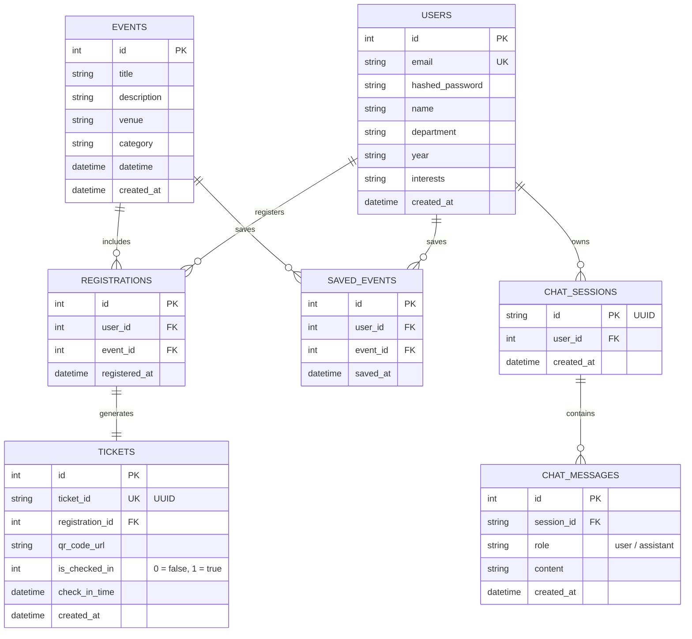

# 🎓 CampusAI: Event Assistant & Student Hub

CampusAI is an intelligent, multi-agent AI assistant and event management platform designed for college campuses. It enables students to discover academic and social events, receive personalized recommendations matching their skills and interests, register for events, obtain QR-code tickets, check-in to events, and converse with specialized AI agents (Event, Support, Placement, Health).

---

## 🚀 Key Features

### 1. 🤖 Specialized AI Agents
*   **Event Agent**: A Retrieval-Augmented Generation (RAG) chatbot that searches the campus event database and guides students toward relevant activities, hackathons, and workshops.
*   **Support Agent**: Answers student questions regarding campus amenities, scheduling, rules, and general support.
*   **Placement & Health Agents**: Outlines and entry points for campus career guidance and wellness services.

### 2. 📅 Event Discovery & Search
*   **Multi-Field Search**: Real-time client-side and backend-ready search filtering through title, description, venue, and category.
*   **Category Tags**: Fast navigation using active-state category filter chips (e.g., Workshops, Competitions, Placements).

### 3. 🎫 Registration & Ticket Management
*   **Event RSVP**: Seamless RSVP registration for events.
*   **Ticket Generation**: Automatically creates a unique digital ticket with an encoded QR code (via `qrcode.react`).
*   **QR-Code Check-In**: Organizer-facing scanner page that parses ticket QR codes (via `html5-qrcode`) and marks attendance in real-time.

### 4. 🧠 Intelligent Recommendation System
*   **Dynamic Matching Algorithm**: Recommends top 6 events based on user-profile interests, saved events, and registration history.
*   **Scoring Metrics**: Bounded confidence scoring (`0.1 - 0.95`) indicating recommendation relevance (e.g., `category-match`, `personalized`, `popular`).

---

## 🏛️ System Architecture

```mermaid
flowchart TB
    subgraph Frontend [Next.js Client - Port 3000]
        UI[App Components & Router]
        AuthC[Auth Middleware & Cookies]
        Scanner[QR Scanner / html5-qrcode]
        AxiosClient[Axios Client with JWT Interceptor]
    end

    subgraph Backend [FastAPI Server - Port 8000]
        API[FastAPI Router / Endpoints]
        AuthS[JWT Authentication & Bcrypt]
        RecS[Recommendation Service]
        AgentRouter[Agent Routing Middleware]
        
        subgraph RAG Pipeline
            GenAI[Google GenAI Client]
            Gemini[gemini-2.0-flash]
            Chroma[Chroma Vector Database]
        end
        
        SQLAlchemy[SQLAlchemy ORM]
    end

    subgraph Databases
        SQLite[(SQLite / campusai.db)]
        ChromaStore[(Chroma DB Directory)]
    end

    UI --> AxiosClient
    AxiosClient -- HTTP Requests + JWT --API
    API --> AuthS
    API --> RecS
    API --> AgentRouter
    AgentRouter --> GenAI
    GenAI -- Embeddings / Queries -- Chroma
    GenAI -- Completions -- Gemini
    RecS --> SQLAlchemy
    SQLAlchemy --> SQLite
    Chroma --> ChromaStore
```

### Frontend Technology Stack
*   **Framework**: Next.js 16 (App Router)
*   **Language**: TypeScript (strict type-checking)
*   **Styling**: Tailwind CSS & PostCSS
*   **Libraries**:
    *   `axios` for HTTP/API calls
    *   `html5-qrcode` for camera-based QR scanning
    *   `qrcode.react` for rendering SVG/canvas QR codes
    *   `uuid` for front-end session handling

### Backend Technology Stack
*   **Framework**: FastAPI (Python 3.10+)
*   **Database**: SQLite (default local) / PostgreSQL (production configuration)
*   **ORM**: SQLAlchemy
*   **Vector DB / RAG**: ChromaDB (stores event semantic embeddings)
*   **AI Integration**: `google-genai` SDK using:
    *   `gemini-2.0-flash` for high-speed agent conversations
    *   `gemini-embedding-2` (fallback to `text-embedding-004` or `gemini-embedding-001`) for text chunk vectorization
*   **Security**: JWT Token verification via `python-jose` and password hashing via `bcrypt`

---

## 💾 Database Schema

The database uses SQLite/PostgreSQL with the following entity relationships:



---

## 📡 API Reference

### Authentication
*   `POST /auth/signup` - Register a new student profile.
*   `POST /auth/login` - Authenticate credentials and receive a JWT token.

### Events
*   `GET /events` - List all events (supports category filtering).
*   `POST /events` - Create a new event (Admin only).
*   `GET /events/{id}` - Fetch a single event's details.

### AI Chat
*   `POST /chat` - Interact with the AI agent. Sends context-augmented user message + chat history to Gemini, stores messages in DB.

### Recommendations
*   `GET /recommendations` - Get 6 personalized recommendations mapped to user interests.

### Tickets & Check-In
*   `POST /tickets/register` - Register for an event and create a ticket.
*   `GET /tickets/my-tickets` - List current user's tickets.
*   `POST /tickets/check-in` - Mark ticket checked-in via scanned UUID.

---

## ⚙️ Local Setup Guide

Follow these steps to configure and run CampusAI on your local machine.

### Prerequisites
*   [Node.js](https://nodejs.org/) (v18.0.0 or higher)
*   [Python](https://www.python.org/) (v3.10 or higher)
*   A Gemini API Key (obtained from [Google AI Studio](https://aistudio.google.com/))

---

### Step 1: Set Up Backend

1.  **Navigate to the backend directory & create virtual environment**:
    ```bash
    # Open terminal in root project directory
    python -m venv .venv
    ```

2.  **Activate the virtual environment**:
    *   **Windows (PowerShell)**:
        ```powershell
        .venv\Scripts\Activate.ps1
        ```
    *   **macOS / Linux**:
        ```bash
        source .venv/bin/activate
        ```

3.  **Install dependencies**:
    ```bash
    pip install -r backend/requirements.txt
    ```

4.  **Configure environment variables**:
    Create a `.env` file in the **root** folder and add the following keys:
    ```env
    GEMINI_API_KEY=your_actual_gemini_api_key_here
    DATABASE_URL=sqlite:///./campusai.db
    ```
    *Note: The FastAPI backend will load this environment automatically on start.*

5.  **Seed initial events**:
    ```bash
    python -m backend.data.seed_events
    ```

6.  **Start the FastAPI development server**:
    ```bash
    uvicorn backend.main:app --reload --port 8000
    ```
    *The API documentation will be available at `http://localhost:8000/docs`.*

---

### Step 2: Set Up Frontend

1.  **Install Node packages**:
    Open a new terminal window in the root directory (ensure your virtual environment is not running here, or keep them separate) and run:
    ```bash
    npm install
    ```

2.  **Configure Frontend Environment Variables**:
    By default, the client points to `http://localhost:8000`. If you need to change this, create a `.env.local` or edit `.env` in the root:
    ```env
    NEXT_PUBLIC_API_BASE_URL=http://localhost:8000
    ```

3.  **Run the Next.js development server**:
    ```bash
    npm run dev
    ```

4.  **Access the Application**:
    Open [http://localhost:3000](http://localhost:3000) in your web browser.

---

## 🧪 Testing

### Backend Testing
To test the API endpoints directly:
*   Navigate to the Swagger UI page at `http://localhost:8000/docs`.
*   Alternatively, run direct CURL requests (e.g. `curl http://localhost:8000/health`).

### Frontend Linting
To check for syntax or TypeScript standard issues:
```bash
npm run lint
```
