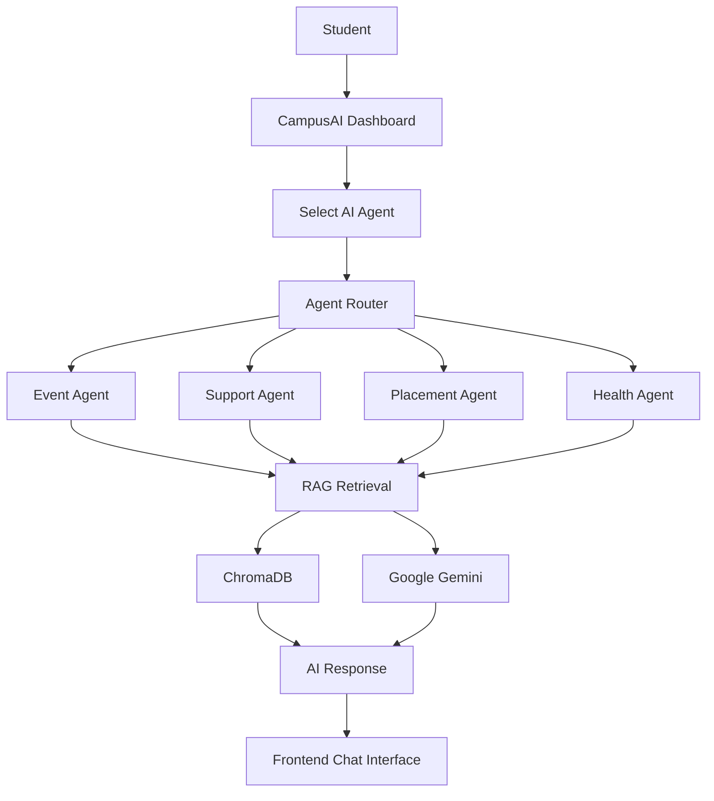
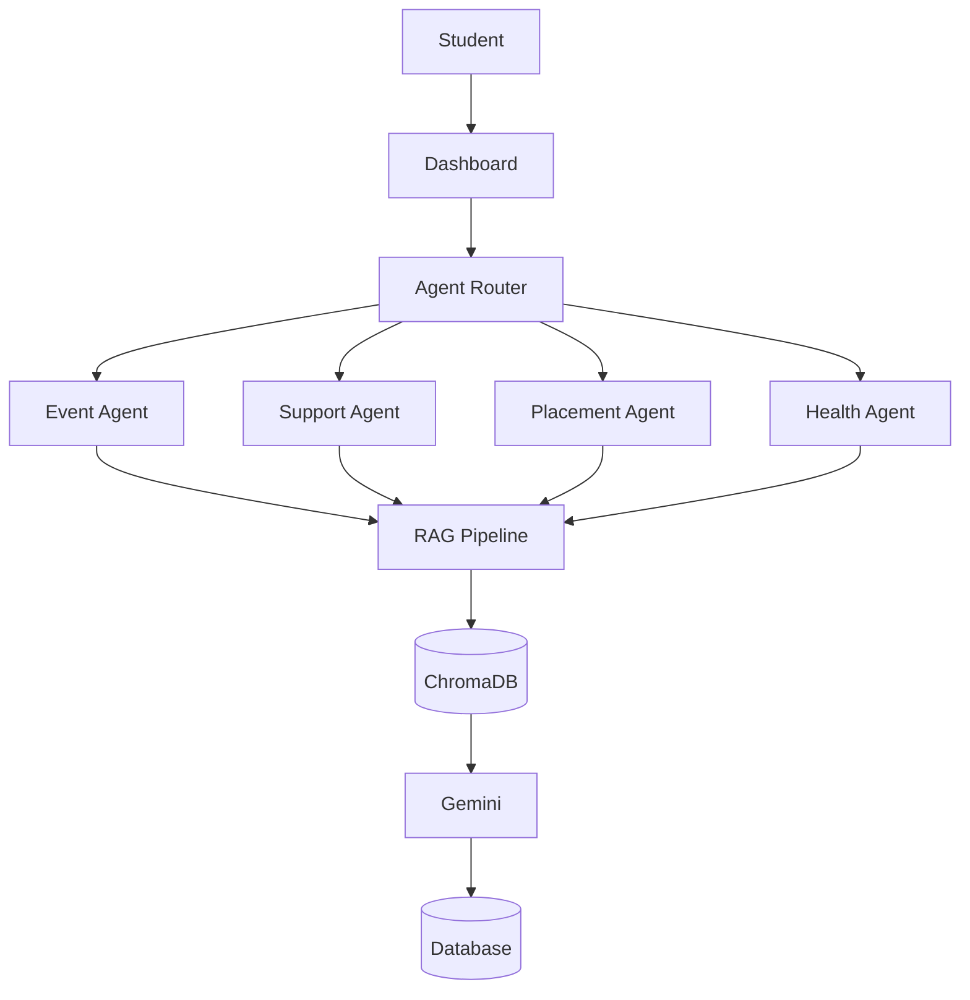

# CampusAI

[](LICENSE)
[](https://nextjs.org/)
[](https://fastapi.tiangolo.com/)
[](#)

CampusAI is a multi-agent AI platform designed for smart university campuses. It enables students to discover academic and social events, receive personalized recommendations, register for events, obtain QR-code tickets, and converse with four specialized AI agents designed to assist with campus life, academic policies, career placements, and student wellness.

---

## ⚡ Quick Start

To quickly start the application locally:

```bash
# 1. Activate the Python virtual environment and run the backend
.venv\Scripts\activate # On Windows (or source .venv/bin/activate on macOS/Linux)
uvicorn backend.main:app --reload

# 2. Start the Next.js development server
npm run dev
```

For full setup, database seeding, and configurations, refer to the [Installation](#-installation) section.

---

## 📋 Table of Contents
- [Overview](#-overview)
- [Request Flow](#-request-flow)
- [Quick Start](#-quick-start)
- [Screenshots](#-screenshots)
- [Features](#-features)
- [System Architecture](#-system-architecture)
- [Project Structure](#-project-structure)
- [Technology Stack](#-technology-stack)
- [Installation](#-installation)
- [Environment Variables](#-environment-variables)
- [API Overview](#-api-overview)
- [AI Architecture](#-ai-architecture)
- [Testing](#-testing)
- [Roadmap](#-roadmap)
- [Contributing](#-contributing)
- [License](#-license)

---

## 🔍 Overview

CampusAI acts as a central digital campus assistant that integrates traditional administrative university tools (like event registration, check-ins, and recommendations) with specialized AI agents. To handle query processing efficiently, CampusAI utilizes a centralized `AgentRouter` to dispatch incoming user requests to the appropriate specialized AI agent based on the target topic. 

The platform leverages Retrieval-Augmented Generation (RAG) to ground the AI responses. Each specialized agent queries a ChromaDB vector database to retrieve relevant policy, career, or wellness documents matching the student's query. This retrieved context is then injected directly into the LLM system prompt for Google's Gemini models, ensuring that the generated feedback is highly accurate, context-aware, and aligned with official university guidelines.

---

## 🧭 Request Flow



When a student submits a query, the `AgentRouter` dispatches the request to the appropriate specialized agent (Event, Support, Placement, or Health). The selected agent then retrieves relevant context from ChromaDB using Retrieval-Augmented Generation (RAG) before generating a grounded, contextual response with Gemini. All user chat history and active sessions are persistently saved in the backend database to maintain continuity.

---

## 📸 Screenshots

<!-- Note: Screenshot image files are pending to be added to the docs/images/ folder in future updates -->

### Dashboard

*The main student dashboard featuring event recommendations, categories, and quick navigation.*

### Event Agent

*Interactive chat helper for discovering upcoming hackathons, workshops, and RSVP registrations.*

### Support Agent

*Helper interface answering student queries regarding attendance shortages, exam rules, and class directions.*

### Placement Agent

*Mock interview prep, algorithmic roadmap builder, and recruiter eligibility checker.*

### Health Agent

*Calm student-friendly advice hub for stress management, sleep quality tips, and clinic listings.*

---

## 🤖 Features

### 1. Event Agent
*   **Event Discovery**: Real-time event search and filtering.
*   **Semantic Search**: Custom RAG-based database query lookups.
*   **Registrations**: Seamless RSVP registrations for campus activities.
*   **Ticket Generation**: Automatic SVG QR-code ticket creation.
*   **Check-In System**: Camera-based QR-code scanning to log event attendance.
*   **Saved Events**: Personal collections of bookmarked events.
*   **Recommendations**: Custom event suggestions based on user profiles.

### 2. Support Agent
*   **Attendance Inquiries**: Academic policies and minimum thresholds.
*   **Exams Info**: Registration guidelines and schedule details.
*   **Faculty Directory**: Office contacts and department lookups.
*   **Campus Wayfinding**: Navigational aid for classroom and block locations.

### 3. Placement Agent
*   **Resume Guidelines**: Structural tips and ATS formatting recommendations.
*   **Coding Prep**: Algorithmic mock interview practice.
*   **Aptitude Prep**: Sample quantitative, logical, and verbal practice guides.
*   **Interview Coaching**: Behavioral mock interviews and tips.
*   **Company Cut-offs**: Detailed eligibility criteria for campus recruiters.

### 4. Health Agent
*   **Student Wellness**: Hydration advice, Pomodoro guides, and study habit suggestions.
*   **Nutrition Basics**: Budget-friendly meal planning and exam-week snacking guides.
*   **Sleep Hygiene**: Sleep routines and blue-light mitigation tips.
*   **Exercise Guidance**: Dorm-room stretching exercises and workspace ergonomics.
*   **Campus Services**: Operational directories for student clinics and counseling centers.
*   **Emergency Advisory**: Protocols for urgent health concerns and contact numbers.

---

## 🏗️ System Architecture



---

## 📂 Project Structure

```text
Campus-AI/
├── backend/                  # FastAPI Backend Server
│   ├── agents/               # Multi-Agent Modules
│   │   ├── event_agent/      # Event Discovery & Planning Agent
│   │   ├── health_agent/     # Student Wellness RAG Agent
│   │   ├── placement_agent/  # Placements & Career RAG Agent
│   │   └── support_agent/    # Academic Support RAG Agent
│   ├── api/                  # API Routers and Schemas
│   ├── data/                 # JSON Knowledge Bases for indexing
│   │   ├── health/           # Wellness & Emergency guidance docs
│   │   ├── placement/        # Resumes & Recruiter parameters
│   │   └── support/          # University rules and wayfinding maps
│   ├── services/             # Core DB interfaces & Gemini AI callers
│   └── main.py               # Backend main server entrypoint
├── src/                      # Next.js Frontend Client
│   ├── app/                  # Pages Router (Dashboard, Agent Chats, Signup)
│   ├── components/           # React shared visual blocks
│   │   ├── chat/             # UI elements (ChatBox, MessageBubble)
│   │   └── layout/           # Shared views (Navbar, Containers)
│   └── lib/                  # Local storage persistent session handles
```

---

## 💻 Technology Stack

### Frontend
| Component | Technologies |
| :--- | :--- |
| Framework | Next.js 16 (App Router) |
| Language | TypeScript |
| Styling | Tailwind CSS, PostCSS |
| Libraries | Axios (HTTP client), HTML5-QRCode (Scanner), QRCode.React |

### Backend
| Component | Technologies |
| :--- | :--- |
| Framework | FastAPI |
| Web Server | Uvicorn |
| ORM | SQLAlchemy |
| Security | JSON Web Tokens (JWT), Bcrypt hashing, Python-jose |

### AI
| Component | Technologies |
| :--- | :--- |
| Models | Google Gemini API (gemini-2.0-flash) |
| Embeddings | Google Gemini Embedding API (gemini-embedding-2) |
| Vector Store | ChromaDB |
| Pattern | Retrieval-Augmented Generation (RAG) |

### Database
| Environment | Technologies |
| :--- | :--- |
| Development | SQLite |
| Production | PostgreSQL (Supported) |

### Authentication
| Component | Technologies |
| :--- | :--- |
| Tokens | JWT Authentication |
| Transport | HTTP-Only Cookies |

---

## 🚀 Installation

### 1. Clone the Repository
```bash
git clone https://github.com/your-username/CampusAI.git
cd CampusAI
```

### 2. Backend Setup
1. Create a Python virtual environment and activate it:
   ```bash
   python -m venv .venv
   # Windows:
   .venv\Scripts\activate
   # macOS/Linux:
   source .venv/bin/activate
   ```
2. Install Python dependencies:
   ```bash
   pip install -r backend/requirements.txt
   ```
3. Set up the backend environment variables file (`backend/.env`):
   ```ini
   GEMINI_API_KEY=your_gemini_api_key_here
   DATABASE_URL=sqlite:///./campusai.db
   JWT_SECRET_KEY=your_secure_jwt_secret_key
   ```
4. Seed the database with events and initial data:
   ```bash
   python backend/seed_events.py
   ```
5. Start the FastAPI backend:
   ```bash
   uvicorn backend.main:app --reload
   ```

### 3. Frontend Setup
1. Install Node dependencies:
   ```bash
   npm install
   ```
2. Configure frontend environment variables (`.env.local`):
   ```ini
   NEXT_PUBLIC_API_BASE_URL=http://localhost:8000
   ```
3. Run the Next.js development server:
   ```bash
   npm run dev
   ```

---

## 🔑 Environment Variables

### Backend (`backend/.env`)
| Variable | Description | Example |
| :--- | :--- | :--- |
| `GEMINI_API_KEY` | Developer access token to invoke Google Gemini models. | `AIzaSy...` |
| `DATABASE_URL` | SQLAlchemy connection URI string. | `sqlite:///./campusai.db` |
| `JWT_SECRET_KEY` | Secret cryptographic key used to sign and verify user JWT sessions. | `your-secret-key-here` |

### Frontend (`.env.local`)
| Variable | Description | Example |
| :--- | :--- | :--- |
| `NEXT_PUBLIC_API_BASE_URL` | Base URL pointing to the FastAPI backend microservice. | `http://localhost:8000` |

---

## 🔌 API Overview

*   `/auth`: Handles user session flows including registration (`POST /signup`), authentication (`POST /login`), and token verification.
*   `/events`: CRUD operations for event lists, RSVP registration, and checking attendee tickets.
*   `/chat`: Core chat router endpoint (`POST /chat`) which intercepts the target query payload and routes it using the `agent_type` parameter (options: `"event"`, `"support"`, `"placement"`, `"health"`).
*   `/profile`: Gets and updates student information, saved events, and profile tags.
*   `/recommendations`: Generates personalized event recommendations matching the student's skills.
*   `/tickets`: Serves generated digital tickets with embedded QR codes.

---

## 🧠 AI Architecture

*   **Agent Router**: A central static handler (`AgentRouter`) that checks incoming request metadata and routes the conversation message to the appropriate service module.
*   **Specialized Agents**: 4 distinct RAG-based systems configured with specialized prompts (`EVENT_AGENT_PROMPT`, `SUPPORT_AGENT_PROMPT`, `PLACEMENT_AGENT_PROMPT`, `HEALTH_AGENT_PROMPT`) to enforce strict content boundaries.
*   **Shared AI Service**: Reusable core module (`generate_ai_response`) that interacts with the `gemini-2.0-flash` API using structural system prompts.
*   **Retrieval-Augmented Generation**: Enhances LLM prompts by injecting localized database query matches retrieved from the vector store on each request.
*   **Vector Search**: Uses ChromaDB to generate and query high-dimensional embeddings for local policies and guidelines.
*   **Session Persistence**: Maintains conversation state and recent session IDs inside front-end local storage wrappers.

---

## 🧪 Testing

### Interactive API Docs (Swagger UI)
FastAPI automatically compiles and serves interactive Swagger documentation. Access the UI at:
`http://localhost:8000/docs`

### Backend Testing & Import Validation
Verify file setups and database indexing tasks using:
```bash
python -c "import dotenv; dotenv.load_dotenv('backend/.env'); from backend import main"
```

### Frontend Linting
Check code quality and React hook rules:
```bash
npm run lint
```

### Manual Verification
1. Open the UI, log in, and navigate to `/agents/health`.
2. Select any wellness prompt shortcut (e.g., *Campus Clinic*).
3. Inspect network panels to verify the payload includes `{"agent_type": "health"}` and returns correct responses containing medical boundaries and disclaimer notes.

---

## 🗺️ Roadmap

### Completed
- [x] Event Agent (RSVP, QR Check-In, Recommendations)
- [x] Support Agent (Academic & Wayfinding Policies)
- [x] Placement Agent (Coding, Aptitude & Career Prep)
- [x] Health Agent (Student Wellness, Nutrition & Safety)

### In Progress
- [ ] Admin Analytics
- [ ] Calendar Integration

### Future
- [ ] Push Notifications
- [ ] Mobile Application

---

## 🤝 Contributing

1. Fork the repository.
2. Create your feature branch:
   ```bash
   git checkout -b feature/AmazingFeature
   ```
3. Commit your changes:
   ```bash
   git commit -m "Add some AmazingFeature"
   ```
4. Push your branch:
   ```bash
   git push origin feature/AmazingFeature
   ```
5. Open a Pull Request.

---

## 📄 License

This project is licensed under the MIT License - see the [LICENSE](LICENSE) file for details.
